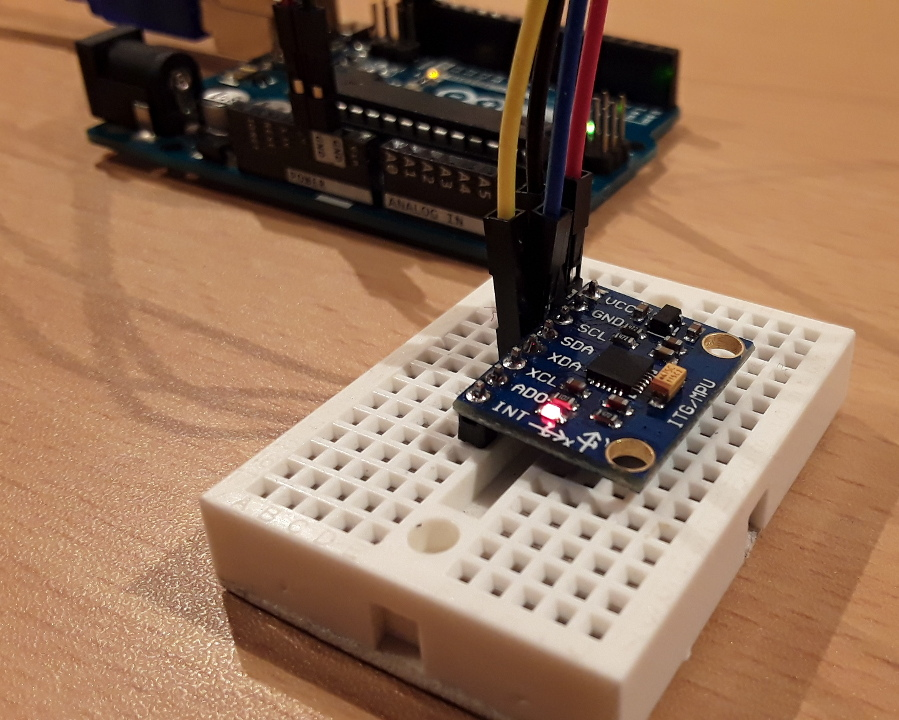

# MPU6050_GY-521_ExProgram

<pre>
Di Repository ini saya menuliskan program untuk sensor Gyroscope 
MPU6050 GY-521, kedepannya di sini akan saya gunakan sebagai 
tempat share hasil reset saya mengenai sensor GYRO MPU6050 GY-521
</pre>

 

 

# Pinout MPU6050 GY-521

<pre>
Berikut gambar PINOUT untuk module sensor MPU6050 GY-521.
</pre>
 

 

 
  Source : <a href="http://www.mschoeffler.de"> Michael Schoeffler </a>
 

  <table border="0" color="Black">
      <tr>
        <td colspan="3" align="center">Follow me on :</td>
      </tr>
      <tr>
        <td></td>
      <td>
      </td>
      <td>
      </tr>
  </table>
